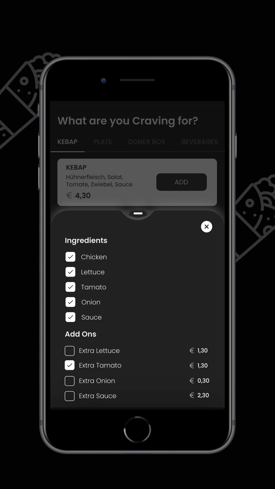
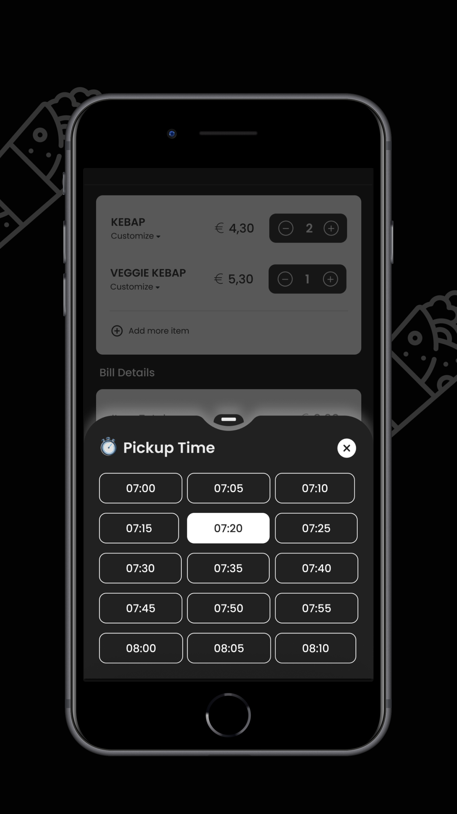

# 🥙 Denis Kebab – Food Ordering App (Flutter)

A fast, easy-to-use food ordering app built with Flutter for **Denis Kebab**, allowing users to browse the menu, place orders, and get delicious kebabs delivered straight to their door.

> 🧑‍🍳 Developed with Flutter for Android, with clean UI and streamlined food ordering flow.

---

## 📲 Download the App

- ▶️ [Google Play Store](https://play.google.com/store/apps/details?id=com.deniskebap&hl=en_IN)
- 🍎 [Apple App Store](https://apps.apple.com/us/app/denis-kebap/id1598089074?l=vi&platform=iphone)

---

## 🖼️ Screenshots

| Home Screen | Menu | Cart |
|-------------|------|------|
|  |  |  |

---

## ✨ Features

- 🍽️ Browse full menu with item details and prices
- 🛒 Add to cart & modify order
- 💳 Checkout with multiple payment options
- 📍 Location-based service availability
- 🔔 Push notifications for order status
- 📦 Order history & re-order functionality

---

## 🔧 Tech Stack

- **Flutter** (Dart)
- **State Management**: (GetX)
- **Backend**: ["Powered by custom API"]
- **Payment Gateway**: [e.g. Sumup]
- **Google Maps** integration

---
